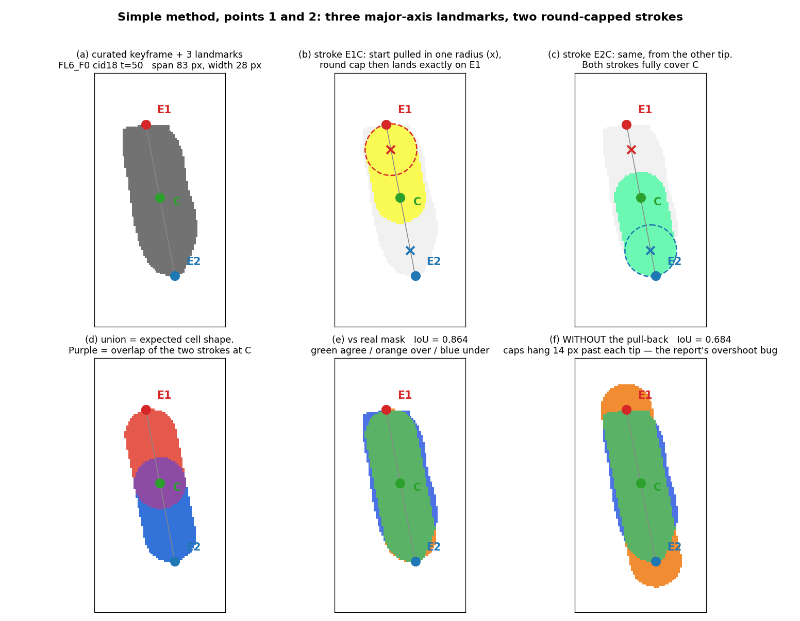
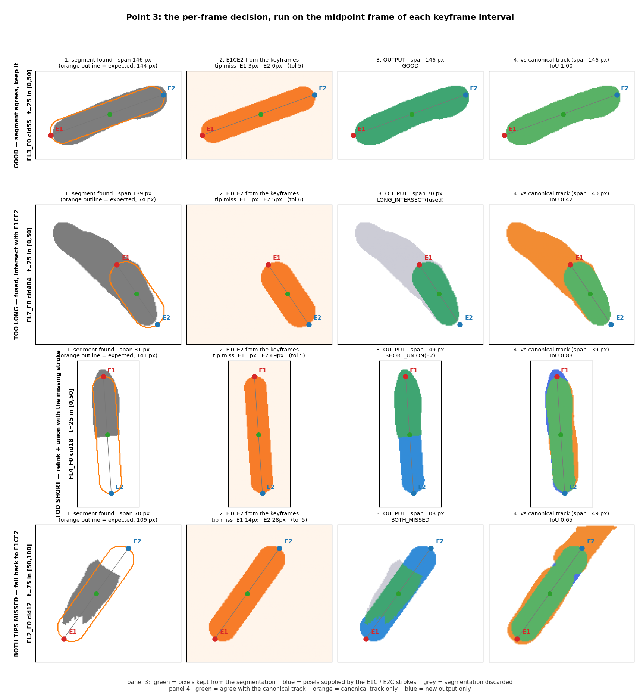
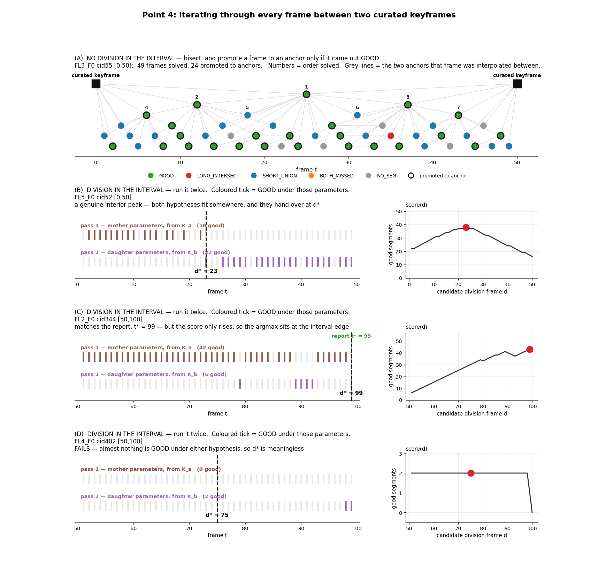
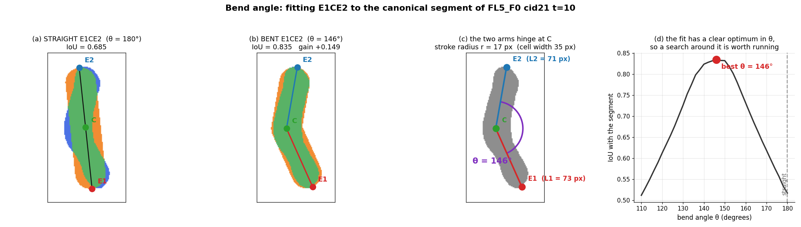
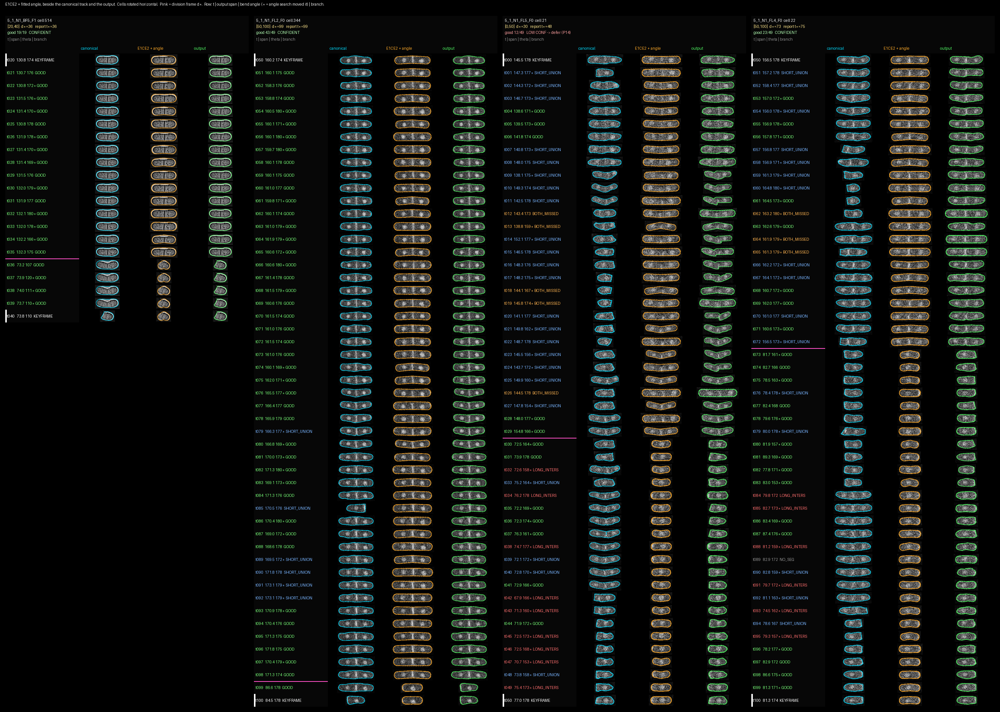
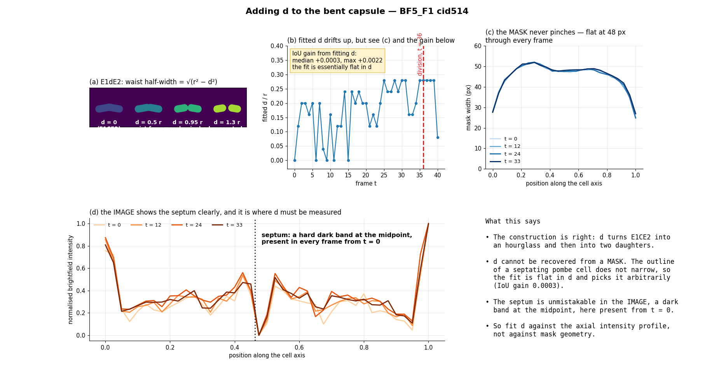

# Development Report: Model-Based Dense Tracking

**Date**: September 11, 2026
**Module**: `SingleCellQuantificationHPC/model_based_dense_tracking.py`,
`SingleCellQuantificationHPC/run_model_based_dense_tracking.py`
**Dataset**: `2026_08_28_M160`
**Stage**: pipeline stage 3 (P14), replacing `scratch/dense_abbt_interval.py`
**Status**: validated on the four cells the September 11 dense-ABBT report gives a
division frame for, plus twelve cells used for shape-model calibration.
Whole-experiment run launched over 700 (film, cell) tasks.
**Policy**: proposes a P14 revision (§9). All output scratch-only; canonical masks
and keyframes read-only throughout (P5, P14).

---

## 1. Executive Summary

Stage 3 was rebuilt around an explicit **shape model** rather than a stack of
repair heuristics. A cell is three landmarks on its major axis — the two pole
tips `E1` and `E2` and the centre `C` — plus a stroke radius `r`. The mask is the
union of two round-capped strokes hinged at `C`. Call it **E1CE2**.

Each interior frame is then a four-way decision against that model instead of a
sequence of conditional repairs. The previous implementation is 1,410 lines with
roughly fifteen tunable constants; this one is 480 lines with eleven, and it runs
an interval in 4 seconds rather than 40.

Three properties hold **by construction** rather than by patching, and each one
retires a defect diagnosed in the September 11 dense-ABBT report:

1. **No geometry feedback.** Arm lengths and radius come only from the curated
   keyframes and from frames accepted as GOOD. A repaired frame can never raise
   the expected length. This is the ratchet of that report's §3.
2. **No painted overshoot.** Each stroke starts one radius in from its tip, so
   the cap lands *on* the tip. That is exactly the constant-radius overshoot of
   its §4, encoded in the construction instead of corrected after the fact.
3. **No invisible pass-throughs.** Every interior frame is decided; there is no
   "untouched" category at all. That report's §7 identified 536 contaminated
   pass-through frames invisible to its metric and closed them with a detector
   and eraser, which grew its measured scope from 1,516 to 1,829 frames. Here the
   category cannot arise, so the scope question does not.

Only the **bend angle** is fitted per frame. Length is never fitted.

Two defects were found during this work by looking at rendered strips, and both
were the method's own (§6). One negative result is recorded in §8.

---

## 2. The Shape Model



Stroke `E1C` runs from tip `E1` to centre `C`; stroke `E2C` mirrors it. Each
starts one radius in from its tip so the round cap lands exactly on the tip. The
union is the expected cell.

**Calibration.** Rebuilding 36 curated keyframes across 12 cells from their own
three landmarks:

| Stroke width | Median IoU | Worst |
| :--- | ---: | ---: |
| 90th percentile of perpendicular extent | 0.855 | 0.586 |
| Maximum perpendicular extent | 0.858 | 0.545 |
| Median perpendicular extent | 0.488 | 0.384 |

The 90th percentile is used. The pull-back is worth 0.864 against 0.684 on
`FL6_F0` cid18 t=50: without it each cap hangs a full radius past the tip.

**A correction to the first formulation.** Defining `E1` and `E2` as the extremes
along the principal axis puts all three landmarks on one straight line by
construction, so the hinge cannot bend — the bent and straight variants scored
identically to three decimals on all 36 keyframes. The bend only becomes real
once the arms carry independent angles (§5).

---

## 3. The Per-Frame Decision



```
no segment                    -> E1CE2
both tips in, not over-long   -> the segment unchanged          GOOD
both tips in, over-long       -> segment AND E1CE2              fused, cut
one tip in, segment too short -> segment OR neighbour OR stroke to the missing tip
one tip in, segment too long  -> segment AND E1CE2              cut
neither tip in                -> E1CE2
```

**The length gate on GOOD is load-bearing.** "Both tips present" is not evidence
that a segment is the cell: a fused blob contains both of our tips *and* a whole
neighbour. Without the gate, `FL7_F0` cid404 was accepted at frame 25 as GOOD at
139 px against an expected 74. Eight of 24 midpoint frames were accepting fused
segments this way — the same mechanism as §7 of the dense-ABBT report, reproduced
in a new implementation. Requiring the span to be within `1.25 ×` expected sends
those to the cut branch instead.

Branch distribution at the midpoint frame of 24 keyframe intervals, after the gate:

| Branch | Count |
| :--- | ---: |
| Cut against E1CE2 | 9 |
| Union with the missing stroke | 7 |
| Segment kept as GOOD | 6 |
| Fall back to E1CE2 | 2 |

---

## 4. Iteration, and Division Timing Without a Model



**No division in the interval:** bisect. Solve the middle frame; promote it to an
anchor **only if it came out GOOD**; recurse. A repaired frame is emitted but
never becomes a reference. On `FL7_F0` cid404 this promoted nothing at all: 47 of
49 frames were fused and were cut. Under the old method that same contamination
set the expected length to 145 against curated anchors of 72 and 76.

**Division in the interval:** run it twice, once with the mother parameters from
`K_a` and once with the daughter parameters from `K_b`, then take the frame `d`
maximising `#good(mother, t<d) + #good(daughter, t>=d)`.

A plain count of good segments reproduces the division frame the trained HMM and
likelihood classifier produced:

| Cell | Dense-ABBT `t*` | Model-based `d*` | Confidence |
| :--- | ---: | ---: | :--- |
| `BF5_F1` cid514 | 36 | 36 | confident |
| `FL2_F0` cid344 | 99 | 99 | confident |
| `FL4_F0` cid22 | 75 | 73 | confident |
| `FL5_F0` cid21 | 48 | 23 | **low — defers (P14)** |

This is worth weighing against §6.2 of the dense-ABBT report, which concluded the
trained emissions have no vocabulary for a fused frame and that the packaged HMM
is a division-timing scorer, not a per-frame labeller. A good-segment count needs
no emission model.

**Confidence gate.** cid21's scan explains 22% of the interval and has a 29-frame
plateau. It is the only one of the four that disagrees, and the gate
(`peak_frac >= 0.40`, `plateau <= 10`) catches it without being tuned to it. Such
a cell defers to the stage-1 keyframe call, as P14 already prescribes.

**An honest note on cid21.** With the *straight* model the scan returned 48,
matching the report exactly. Adding the bend moved it to 23. The bend is right
for mask quality (§5) and wrong for this cell's division contrast; the gate is
what makes that safe rather than silent.

---

## 5. The Bend Angle



Fission yeast cells are not straight rods, and they twist as they divide. Giving
the two arms independent angles, with `theta` the angle between them, captures
this. On the `FL5_F0` cid21 t=10 segment — a representative division-phase bend —
the fit gives `theta = 146°` at IoU 0.835 against 0.685 for the straight capsule,
with a sharp optimum.

**Only the angle is fitted per frame**, over `+/-25°` in 5° steps around the
interpolated value. Lengths stay anchored (§1). The search moved the angle on 114
of 166 frames, median shift 5°.

**The angle search is disabled inside the division scan.** The scan is a
hypothesis test between mother and daughter; letting each hypothesis bend itself
into agreement destroys the contrast the changepoint depends on.

**The twist is visible in the data.** `BF5_F1` cid514 holds `theta` near 175°
through the whole mother phase, then drops to 107–120° immediately after its
division frame.

---

## 6. Two Defects Found by Rendering Strips

Both were introduced by this work and both were found by looking at the output
frame by frame, not by a metric.

**Unbounded graft.** The too-short branch relinks a neighbouring segment to reach
the missing tip and unioned it in without checking the result. On `FL4_F0` cid22
it grafted a whole second cell across eight frames; frame 51 came out at 236 px
against 157 expected, rendering as an elbow of two cells. §4.2 of the dense-ABBT
report describes this same unbounded whole-label fuse in the old code.

**Over-eager cut.** The intersection branch had no floor, leaving `FL5_F0` cid21
frame 49 as a 29 px fragment against 77 expected.

Both were fixed with the length test the GOOD branch already used, applied to the
two branches that skipped it. Spans within `[0.75, 1.25] ×` expected:

| Cell | Before | After |
| :--- | ---: | ---: |
| `BF5_F1` cid514 | 19/19 | 19/19 |
| `FL2_F0` cid344 | 49/49 | 49/49 |
| `FL5_F0` cid21 | 47/49 | 49/49 |
| `FL4_F0` cid22 | 38/49 | 49/49 |

The 12 guard rejections are exactly the 12 previously out-of-band frames.

**Fragment bridge.** `FL4_F0` t=60 emitted two disconnected pieces, because the
segment covered 71 px of a 163 px expectation and the stroke never reached it.
Extruding from `C` to the segment centroid after the union closes it. Fragmented
frames across the four cells went from 1 to 0, and good segments from 91 to 99.

---

## 7. Quality Control



Vertical strips, three columns per cell: canonical track, fitted E1CE2 with its
bend angle, and the output, all rotated horizontal so poles line up (P13).

On frames where the segmentation is trusted (the GOOD branch), the fitted E1CE2
matches that segment at **median IoU 0.863 over 97 frames**, worst 0.760. That is
the same range as fitting E1CE2 to a curated keyframe from its own landmarks
(0.855, §2): a shape interpolated from two keyframes, with only the angle allowed
to adapt, matches an unseen frame about as well as a direct fit to a curated one.

The rows to scrutinise first are those tagged `BOTH_MISSED`, where E1CE2 is
standing in for the cell entirely.

---

## 8. Negative Result — the Separation Parameter `d`



An extension was proposed: let each stroke stop short of `C` by a distance `d`,
so the waist half-width is `sqrt(r^2 - d^2)` — `d = 0` is E1CE2, `d` near `r`
pinches shut, `d > r` gives two separated daughters. Biologically this is the
right shape for a septating cell.

**`d` is not recoverable from a mask.** Fitting it improves overlap by 0.0003 in
the median and 0.0022 at best, so the objective is flat and the fit picks `d`
arbitrarily. Checked directly rather than through the fit: the mask width across
the middle of `BF5_F1` cid514 is flat at 47–49 px in **every** frame from 0 to
39, straight through its division at 36. The outline never pinches.

The septum is unmistakable in the **image** — a hard dark band at the midpoint of
the brightfield axial profile, present in every frame from t=0. So `d` belongs in
stage 4 (quantification), fitted against the axial intensity profile, not in
stage 3 against mask geometry. It is **not implemented** in the tracker.

A second finding blocked the original test: `FL5_F0` cid21's canonical masks are
not a coherent cell over time, with span alternating between roughly 75 and 157
px frame to frame.

---

## 9. Policy — Proposed P14 Revision

`docs/PROJECT_POLICY.md` was **not edited**. The committed copy predates P13 and
P14; the authoritative text is uncommitted in the working tree, and editing a
stale copy would drop those sections. The following is proposed for the owner to
apply.

Rename stage 3 to **Model-based dense tracking**, and add to the stage-3 rules:

- **The expected shape is a model, not an accumulation.** Stage 3 carries an
  explicit per-cell shape — two pole tips, a centre, a width and a bend angle —
  built from the two bracketing curated keyframes. Every per-frame mask is a
  decision against that shape.
- **Length is anchored; only the angle is fitted.** Arm lengths and width derive
  solely from curated keyframes and from frames accepted as GOOD. No other frame
  writes back into the reference. The bend angle may be fitted per frame, within
  a bounded window.
- **Tip presence is not sufficient evidence.** A segment containing both expected
  tips is accepted only if its span is within `1.25 ×` the expected span; a fused
  blob contains both tips and a neighbour.
- **Every branch output is length-checked.** Any branch that adds pixels is
  rejected if the result exceeds `1.25 ×` expected; any branch that removes
  pixels is rejected if the result falls below `0.75 ×` expected. The two failure
  modes of this family are the unbounded graft and the over-eager cut.
- **Every interior frame is decided.** There is no pass-through category, and the
  quality metric is reported over all emitted frames.
- **Report stage 3 as spans-in-band first**, with the GOOD-branch share and the
  branch histogram alongside, then division agreement with stage 1.

Unchanged and reaffirmed: stage order, keyframes read-only from stage 2 onward,
low-confidence dense `t*` defers to the stage-1 call, and never deriving expected
geometry from unvalidated interior frames.

---

## 10. Whole-Experiment Run

Selection: work-queue status `good`, `corrected` or `unreviewed` — 950 cells,
excluding the 77 marked `bad`. Expanded through `sequence_linkage.json` to **700
unique (film, cell) tasks**, 607 of them fluorescence, each with two keyframe
intervals.

```
python SingleCellQuantificationHPC/run_model_based_dense_tracking.py \
    --status good corrected unreviewed --channel both
```

Output is scratch-only (P5): one CSV of dense masks per (film, cell) under
`scratch/model_based_dense_out/`, plus `model_based_dense_summary.csv` carrying
per-interval frame counts, branch histogram, guard-rejection counts, the division
frame and its confidence. The run is resumable; an existing output CSV is skipped
unless `--force`.

### 10.1 Results

Completed in **110 minutes**: 696 cells, 1,392 intervals, **62,383 emitted
frames**. Five interval failures across three cells, all `KF_NO_MASK` — a
bracketing keyframe has no mask, which is a stage-1 escalation, not a tracker
fault (P14: keyframes are read-only here).

| Metric | Frames | Share |
| :--- | ---: | ---: |
| **Spans within `[0.75, 1.25] ×` expected** | **62,109** | **99.6%** |
| Segment kept unchanged (GOOD) | 45,105 | 72.3% |
| Union with a stroke to the missing tip | 13,207 | 21.2% |
| Cut against E1CE2 (fused or over-long) | 1,933 | 3.1% |
| `NO_SEG` — model only | 1,265 | 2.0% |
| `BOTH_MISSED` — model only | 873 | 1.4% |

Reported over **all** emitted frames, with nothing excluded (§9).

**3.4% of frames carry no image evidence** (`NO_SEG` plus `BOTH_MISSED`). These
are pure model output and must be flagged or excluded in stage 4 (§12.1).

**The guards are not decoration.** The relink length check rejected a graft on
**4,506 frames**, roughly one in three of all union-branch frames. Without it
each of those would have fused a neighbouring cell into the mask, which is the
defect of §6 and of the dense-ABBT report's §4.2. The fragment bridge fired 335
times.

By QC status, quality is nearly flat, which is the useful result — unreviewed
cells are not measurably worse:

| Status | Intervals | Frames | In band | GOOD |
| :--- | ---: | ---: | ---: | ---: |
| good | 124 | 5,476 | 99.7% | 79.5% |
| corrected | 663 | 29,727 | 99.6% | 72.3% |
| unreviewed | 600 | 27,180 | 99.5% | 70.8% |

**Division**: 96 dividing intervals, 65 of them (68%) confident. The other 31
defer to the stage-1 keyframe call (P14).

Quantification (stage 4) follows on the emitted mask series and is **not**
included in this report.

---

## 11. Artifacts

| Path | Contents |
| :--- | :--- |
| `SingleCellQuantificationHPC/model_based_dense_tracking.py` | Stage-3 implementation |
| `SingleCellQuantificationHPC/run_model_based_dense_tracking.py` | Whole-experiment runner |
| `scratch/model_based_dense_out/` | Dense masks per (film, cell) + summary |
| `scratch/model_based_dense_run.log` | Run log |
| `docs/figures/model_based_dense_tracking/` | The six figures above |
| `scratch/simple_method_*.py` | Prototypes the figures were generated from |

---

## 12. Limitations and Next Steps

1. **`BOTH_MISSED` frames are pure model output.** They carry no image evidence
   and should be excluded from quantification or flagged, not silently used.
2. **The division scan holds keyframe parameters fixed** across the interval, so
   when one hypothesis fits nearly everything the changepoint slides to the
   interval edge. The confidence gate catches this; it does not fix it.
3. **The bend cost cid21's division frame** (§4). Angle freedom and division
   contrast trade against each other and the balance is set by one flag.
4. **Acceptance is measured on four cells** for division and twelve for shape.
   Promotion of this output to stage-4 input is a P2 L4 checkpoint and needs the
   whole-run summary, not these.
5. **`d` in stage 4** (§8), fitted against the axial intensity profile.
6. **Re-baseline against dense-ABBT** on the `hard10` set. Its current figure is
   1,569 / 1,829 pole-usable (86%) after the eraser integration widened the
   scope, and that report warns its own raw rates are not comparable across the
   scope and reference changes. The two implementations therefore have to be
   compared on one metric computed over all emitted frames for both — a fixed
   reference, not each method's own — before either is promoted to stage-4 input.
