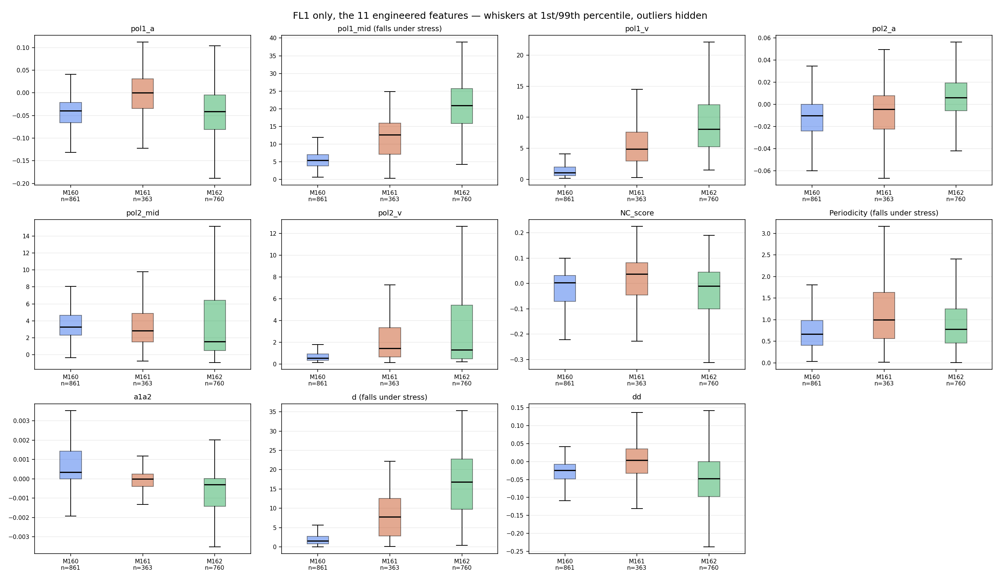
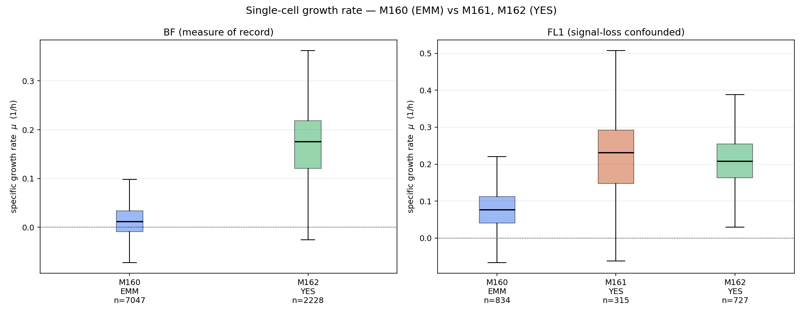

# M161 and M162 through the pipeline, and the growth-rate result

**Dates:** 2026-09-21 to 2026-09-22
**Experiments:** 2026_09_03_M161, 2026_09_09_M162, with 2026_08_28_M160 as the
existing arm
**Figures:** `figures/m161_m162_growth/`
**Related:** [continuous manifold](development_report_2026_09_21_m160_continuous_manifold.md),
[UMAP null calibration](development_report_2026_09_21_umap_null_calibration.md)

---

## 1. Goal

M160's polarity manifold is continuous with no discrete dynamic modes, and the
laser was excluded as the cause. The next question was what else could account
for it. M161 and M162 were brought through the pipeline to find out: M161 and
M162 share strain, probe, medium (YES) **and** acquisition settings, differing
only in session, so they are replicates of each other, while M160 differs in
medium (EMM).

## 2. What was built

All are copy-to-modify variants (P15) — the M160 and M162 originals are frozen
records and were not touched.

| Script | Stage | Note |
| --- | --- | --- |
| `segment_m161_keyframes.py` | 1/2 | pinned to M162's checkpoint so masks stay comparable |
| `segment_m161_all_frames_local.py` | 2 | `verify_inputs` scoped to `--films` |
| `track_and_link_m161.py` | 3 | gains `--films`; `SEQS` listed explicitly |
| `run_model_based_dense_tracking_m161.py` | 3 | ABBT optional; provenance name fixed |
| `build_features_m161.py`, `build_features_m162.py` | 5 | output names derived from `EXP_NAME` |
| `compare_fl1_features.py` | analysis | three-way, Cliff's delta + Holm |
| `growth_rate_m16x.py` | analysis | BF primary, FL cross-checked |

## 3. Runs

| Step | M161 | M162 |
| --- | --- | --- |
| NAS -> SSD | 1.20 GB (FL1) + BF1 | already local |
| frame export | 404 TIFFs | already done |
| keyframe segmentation | 12, 90-103 cells each | already done |
| all-frame segmentation | 389 frames, 7.6 s/frame | already done |
| stage 3 dense tracking | 366 cells, 10 `KF_NO_MASK` failures, 143 min | already done |
| stage 4 quantification | 363 cells, 0 errors, 74.7 min | 758 cells, 0 errors, 137.9 min |
| stage 5 features | 363 cells, 0.49% model-only | 760 cells, 0.21% model-only |

## 4. What went wrong, and what it cost

### 4.1 The all-frame segmentation stage was skipped (the expensive one)

M161's stage 3 was first run against keyframe masks alone. The dense tracker
falls back to the shape model for any frame without a segmentation, so **97.02%
of M161's frames came back model-only**, against 0.21% for M162 and 0.0% for
M160 — intensity measured from inferred segments rather than image evidence.

This was caught only at stage 5, by reading the model-only percentage. It cost
a full rebuild of stages 3-5 (roughly 4 h). Comparing those features against
M162 would have compared methodology, not biology, and since the direction of
the bias is not obvious it could have produced a confident and wrong answer
about session-level stress.

**Lesson:** the model-only percentage is a pipeline-integrity check, not a
footnote. It should be asserted against a threshold at stage 5 rather than
printed. The stage-3 runtime was itself a tell — 36 min on keyframes against
143 min on real segmentation.

### 4.2 Copy-to-modify carries the donor's output filenames

Three separate instances in two days:

- `run_model_based_dense_tracking_m161.py` wrote `m162_dense_tracking_*.provenance.json` into M161's folder;
- `segment_m161_all_frames_local.py` wrote `m162_all_frame_segmentation.provenance.json` into M161's folder;
- `build_features_m160.py` hard-codes `umap_features_m160.csv`, so a naive copy would have written M160-named tables into M161's and M162's folders.

Each would have silently mislabelled provenance (P3). P15 mandates
copy-to-modify for experiment-dated scripts, so this recurs by construction.
The durable fix is to derive output names from the experiment constant, as
`build_features_m16{1,2}.py` now do via `EXP_TAG`.

**Recommendation:** add to P15 — *a copied script must derive every output
filename from its experiment constant, never inherit a literal from the donor.*

### 4.3 Name collision between M161 and M162

M161's prefix `NeonG_YES_1_` is one underscore-delimited token longer than
M162's `NeonG_YES_`. A substring match cross-matches the two experiments
silently. The first M161 stage-3 run queued **0 tasks** with no error because
`SEQS` still held M162's names. All sequence lists are now explicit, never
substring-matched.

### 4.4 Memory

The machine (18 GB RAM, swap capped at 7-8 GB) is the binding constraint.
Running M161 stage 3 and M162 stage 4 concurrently put 8 workers on 11 cores,
drove swap to 6.7 GB and tripled per-cell time; a later M161 stage-4 run was
killed outright by the OS.

The kill left a trap: 363 quant files present, of which only **13** had been
rebuilt. Because the run used `--force`, a naive restart without it would have
skipped the 350 stale files as current and produced a table 96% contaminated,
silently. The directory was deleted and rebuilt with 3 workers and no
`--force`, so the run is genuinely resumable.

**Lesson:** prefer resumable over fast. Serialise memory-hungry stages;
aggregate throughput is memory-bound, so parallelism buys nothing and risks
losing both jobs.

### 4.5 Two data facts discovered, not bugs

- **M162's BF `TrackedCells` are keyframe-only** — 3 of 41 frames carry an RLE.
  Per-frame BF area must come from the stage-3 dense masks instead.
- **M161's BF protocol is 10 frames at 30 s = 5 min**, against M160's and
  M162's 41 frames = 20.5 min. Over 5 min a 3 h doubling moves area ~1.9%, at
  or below segmentation noise, so **no BF growth rate can be recovered for
  M161 however it is processed**. Its BF keyframes are also not `[0, 20, 40]`.

## 5. Results

### 5.1 Session variance is large

M161 and M162 — same strain, probe, medium, settings and segmentation
checkpoint (verified identical `sha256`), differing only in session — still
differ at **5 of 11 features with medium-or-large effect**, `pol1_mid` 12.7 vs
20.9 and `d` 7.8 vs 16.8.

| pair | mean abs Cliff's delta |
| --- | ---: |
| M161 vs M162 (replicates) | 0.314 |
| M160 vs M161 | 0.419 |
| M160 vs M162 | 0.438 |

Replicate separation is comparable to cross-condition separation, so **this
design cannot attribute a modest difference to any single factor**. Single-session
comparisons cannot resolve effects of this size.

### 5.2 M160 is growth-arrested

Per-cell fit of ln(area) against time within one film, from brightfield:

| | medium | n | mu (1/h) | doubling | literature |
| --- | --- | ---: | ---: | ---: | --- |
| **M160** | EMM (minimal) | 7,047 | **+0.0120** | **57.7 h** | 3-4 h |
| **M162** | YES (rich) | 2,228 | **+0.1762** | **3.93 h** | 2-2.5 h |

M160 is ~15x slower than M162 **and** ~15x slower than EMM itself predicts.
That is arrest, not minimal-medium growth — and it is an effect large enough to
survive the session variance in 5.1, which the polarity differences are not.

Controls: median cell size is near-identical across all three (length 113-116
px), so this is not a scale artifact; and FL-derived size fails only where
signal is weak — FL1 tracks BF in M162 (0.208 vs 0.176) but overstates M160 6x.

**This explains M160's low polarity contrast.** Non-growing cells do not extend
tips, so the polarity signal is weak.

> **Corrected later the same day — see section 6b.** This section originally
> continued "the continuous, mode-free manifold is what an arrested population
> should produce", treating arrest as the explanation for the absent discrete
> modes. That inference was wrong: M162, growing normally, has no discrete
> modes either. Arrest explains the weak contrast, not the absent modes.

## 6. Corrections to earlier reports

- M160 uses the **same strain and probe** as M161 and M162; only the medium
  differs. Earlier speculation about a strain/fluorophore confound is withdrawn.
- The two reports dated 2026-09-21 were named `2026-09-21_*.md`, which does not
  follow the P3 scheme. They are renamed to
  `development_report_2026_09_21_<topic>.md` and all references updated.
  Figures previously living only on the SSD are now committed under
  `figures/`, as P3 requires.

## 6b. Correction issued 2026-09-22 (later the same day)

> **ITSELF SUPERSEDED, same day — see [development_report_2026_09_22_modes_are_real.md](development_report_2026_09_22_modes_are_real.md).**
> This section concluded the healthy arm has no discrete modes either. That is
> wrong: `pol2_mid` is multimodal in M162 (ΔBIC −815, dip p < 0.001) and in every
> other dataset. The modes are real; the clustering test could not see them.
> The growth-rate result in section 5.2 is unaffected — it is measured on
> brightfield areas, independently of any manifold.

M162's UMAP was built and given the P16 null calibration. It does **not** clear
its own shuffled null by any meaningful margin (+0.063 at the fraction-matched
setting, against +0.9 for genuine clusters), so **the healthy arm has no
discrete modes either**. Growth arrest therefore does not explain the absence
of modes in M160 — only its low polarity contrast, which it still explains.

Recorded as a correction section in
[the 2026-09-21 report](development_report_2026_09_21_m160_continuous_manifold.md).

## 7. Next

Build M162's UMAP (stage 6) — it is the healthy, well-segmented arm and the
natural reference. Then M161's, and only then any cross-experiment manifold,
with P16's shuffled-dimension nulls re-derived at each experiment's own n and
latent dimension.

Open questions: why the EMM culture was arrested (medium batch, nutrient
exhaustion before mounting, culture age or density, prep stress) — which needs
a purpose-designed experiment with **replicate sessions per condition**, given
5.1.
